# gpSTS (powered by gpCAM) library within Nanonis/LabVIEW framework
A Python-LabVIEW interface to run autonomous bias spectroscopy measurements.

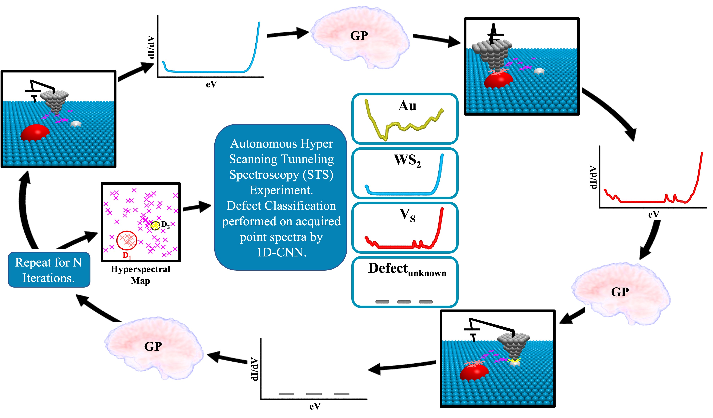

## Requirements & Overview

Nanonis v4.5 (SPECS) controlled SPM setup.
The nanonis_programming_interface_v4.0 or newer needs to be installed.
LabView (2019 or higher) needs to be installed.
Python 3.8 or higher

from CLI with Nanonis controller, labVIEW application, and bias spectroscopy module
running:

```
~python Run_gpSTS.py
```

after a completed autonomous experiment, from CLI:

```
~python Run_postprocessing.py
```

after postprocessing is completed, training or classification with a trained model can be performed, from CLI:

```
~python Run_CNN.py
```

Experimental configuration and hyperparameter specification is in: 

```
Config.py
```

## Model Training

The structure of the training path is shown below, where separate ```train``` and ```validation``` folders are used for initial loading.

    ├── train
    │   ├── class1
    │   ├── class2
    │   ├── ...
    └── validation
        ├── class1
        ├── class2
        ├── ...

**Dataset used in publication is provided at:** https://doi.org/10.5281/zenodo.5768320.

## Python Dependencies

The following dependencies are required, and should be available from PyPi.

* ```numpy```   — support for large, multi-dimensional arrays
* ```matplotlib``` — visualization tool
* ```scipy``` — scientific and technical computing library
* ```gpcam``` — library for autonomous experimentation
* ```fvgp``` — library for highly flexible function-valued Gaussian processes
* ```torch``` — library for tensor computation and deep neural networks
* ```torchvision``` — library for computer vision

## LabVIEW Dependencies
* ```Nanonis Programming Interface V4.0 - R7683```   — user library to interface with Nanonis controller.
* Also see https://github.com/jthomas03/gpSTS/blob/main/src/labview/NanonisProgInterface_gpSTS_required.lvlib
    * ```Save dat File.vi```
    * ```Save dat File (Core).vi```
    * ```Prog Interface - OpenAppRef.vi```
    * ```Get Session Path.vi```
    * ```Signal Names Get.vi```
    * ```ScanFrame Set.vi```
    * ```Z-Ctrl Setpoint Set.vi```
    * ```XY-Pos Set.vi```
    * ```BiasSpectroscopy SetTimings.vi```
    * ```BiasSpectroscopy Start.vi```
    * ```Scan Action.vi```
    * ```Scan Status Get.vi```
    * ```Scan WaitEOS.vi```
    * ```ScanBuffer Get.vi```
    * ```Scan Grab Frame Data.vi```
    * ```ScanFrame Get.vi```
    * ```Save sxm File.vi```
    * ```Prog Interface - OpenAppRef with methods.vi```

## LabVIEW Hierarchy
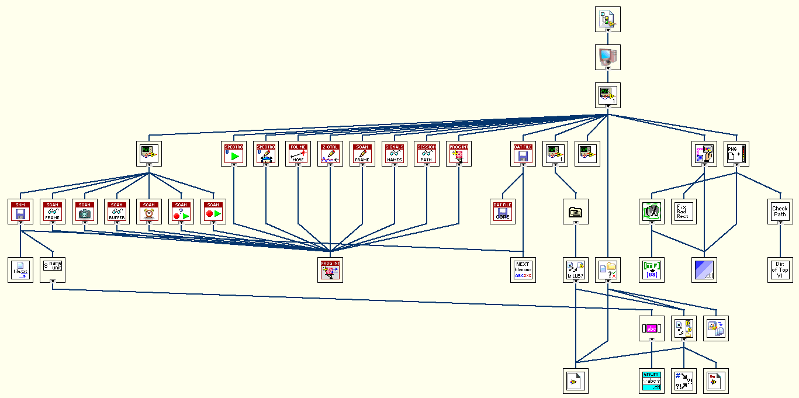

# Tutorial - using the Nanonis Simulator Version Generic V 

## 1. Download and install library

``` shell
git clone https://github.com/jthomas03/gpSTS.git
```

## 2. Parameter Selection

In `config.py` a number of parameters are required to begin an experiment.

``` 
nanonis_config = {
	"Nanonis_Settings": {
		"File": "gpSTSinit", 
        "ExperimentName": "Test Out",
		"Version": "0.0.1",
		"ImageStart": "test_img001.sxm",
		"FolderLocation": "C:\\gpSTS\\src\\",
        "DataLocation": "C:\\gpSTS\\src\\data\\",
		"Channel": "Z",
		"ImDirection": "forward",
		"SpectralRange": [-1,1],
        "NumSpectralPoints": 1200,
		"Center_Point": [174,34],
		"Search_Window": 40,
		"Feature_Window": 20,
		"ScanCurrent": 30e-12,
		"SpecCurrent": 200e-12,
        "STSbias": "Bias calc (V)",
        "STSsignal": "Current (A)"
	},
    "Neural_Network": {
        "TrainingPath": "C:\\gpSTS\\src\\train\\",
        "EpochNumber": 2,
        "ClassNumber": 4,
        "LearningRate": 0.001,
        "BatchSizeTrain": 5,
        "BatchSizeVal": 1,
        "BatchSizeTest": 1
    }
}
```

"ExperimentName" will dictate the name used in a number of files, such as final output, during the GP experiment.

"ImageStart" is the first image collected over the area where hyperspectral data collection is requested, and is required to start the experiment.

"FolderLocation" and "DataLocation" direct file placement and usage.

"Channel" and "ImDirection" are image parameters needed during drift tracking.

"SpectralRange" are values in volts where the experiment will hone in.

"NumSpectralPoints" is spectral resolution.

"Center_Point", "Search_Window", and "Feature_Window" are drift feature location and search window parameters.

Such as the below image will search within a `X1 = (20+40) by X2 = (20+40)` frame during cross-correlation and update the scan window accordingly.

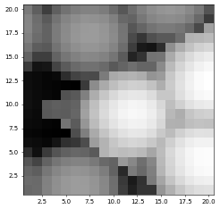

"TrainingPath" is where labeled data for both training, test, and validation are located shown earlier in model training.

The remaining hyperparameters are for training the CNN.

Acquistion function selecton:

``` 
###acquisition functions###
def my_ac_func(x,obj):
  mean = obj.posterior_mean(x)["f(x)"]
  cov  = obj.posterior_covariance(x)["v(x)"]
  sig = obj.shannon_information_gain(x)["sig"]
  ucb = mean + 3.0 * np.sqrt(cov)
  return cov
 ```

Where the upper confidence is given by:

``` 
  return ucb
 ```

Shannon's entropy gain is given by:

``` 
  return sig
 ```
 
 And variance is returned by:

``` 
  return cov
 ```

For further documentation on using Gaussian process regression, please see https://gpcam.lbl.gov/.

For further documentation on using pytorch, please see https://pytorch.org/.


## 3. Usage

Start the Nanonis controller and engage the controller.
Acquire an STM image over the region desired for hyperspectral data collection and save the image.
The image file will provide gpSTS location, frame offsets, and frame dimensions.

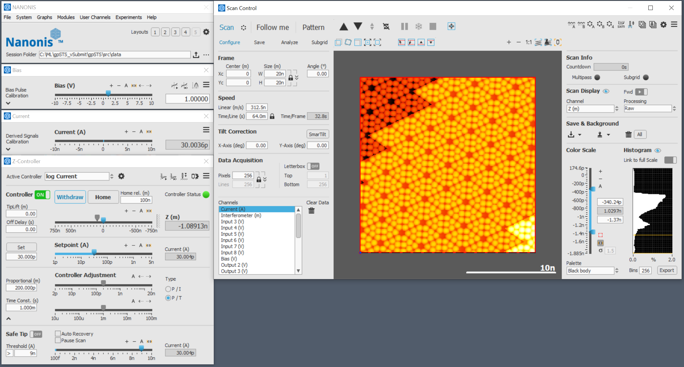

Enable the Bias Spectroscopy module within the controller.
Adjust spectroscopy hyperparameters for high quality spectra acquisition.
Select acquistion channels.

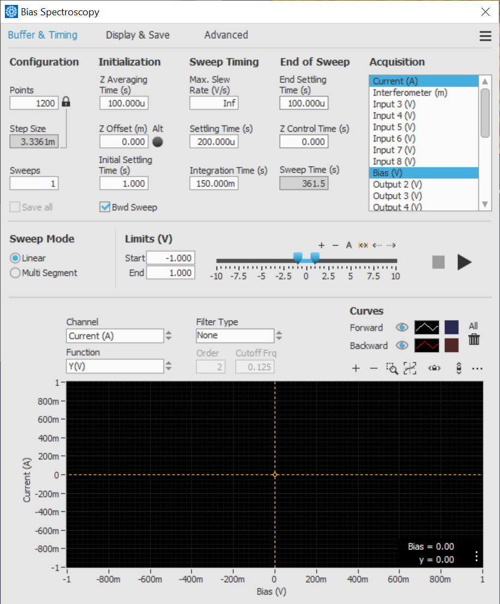

Start the main `gpSTS_app` using the local labview install with all dependencies installed.
Enable collection in the application.

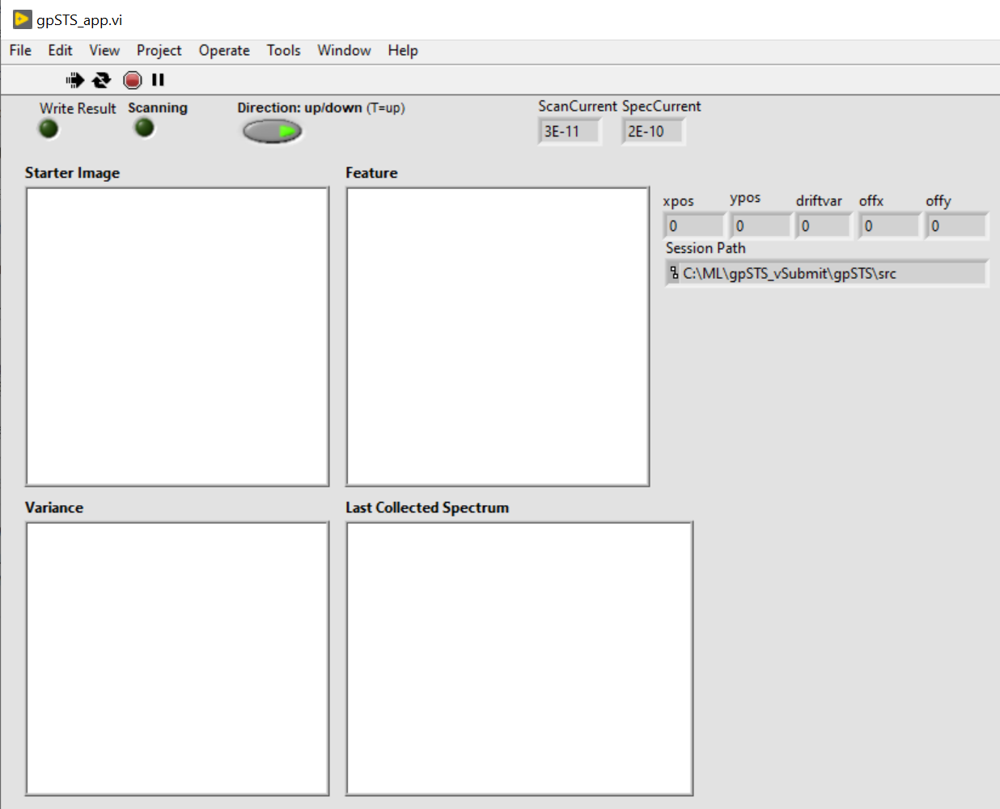

From a command line interface (CLI) start gpSTS:

```
~python Run_gpSTS.py
```

As the experiment progresses, the starter image, feature selected for drift tracking, evolution of the variance function calculated from the Gaussian process, and other scan parameters are displayed in order to track.

Once the experiment completes, commands will no longer be feed to the Nanonis controller and will show complete in the CLI.
```
====================================================
The autonomous experiment was concluded successfully
====================================================
```

The `gpSTS_app` will show locations of acquired spectra along with the final form of the calculated variance spectrum.
In this example for the tutorial, the surface is homogeneous, and therefore the calculated variance is invariant.

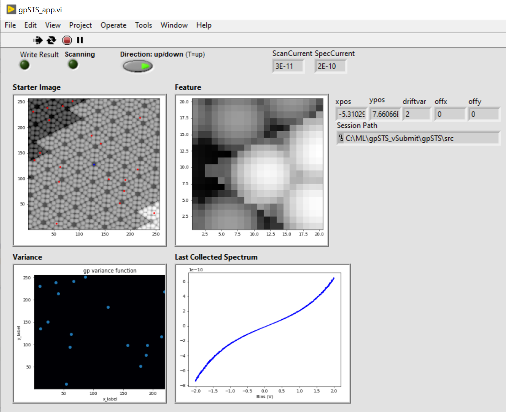

Collected spectroscopy and images collected for drift tracking during the specified interval are now located in the path specified.

To enable processing and output points collected within both a 2D representation and 3D datacube:
```
~python Run_postprocessing.py
```
This will give 4 files and show the 2D interpolated form of your experiment.

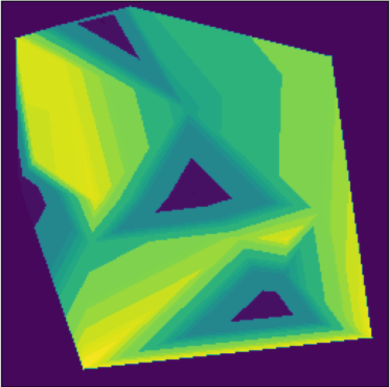

From here you can either train a new CNN model for classification or use an already trained model.
```
~python Run_CNN.py
```
Options will appear to either train a new model on data labeled data within given `train` path, or to classify data.

```
Execute training by entering a 1, classify data by entering a 2, or exit otherwise: 
```

Training a new model will begin to execute training a model based on the input parameters specified by the user and will display progress in the CLI.

Option 2 will then show the following test:

```
Plot interpolated results by entering a 1, plot collected point classification by entering a 2, or exit otherwise: 
```

In this tutorial, again, as the surface is spectroscopically invariant in the Nanonis simulator, only one class exists.

Interpolated results:

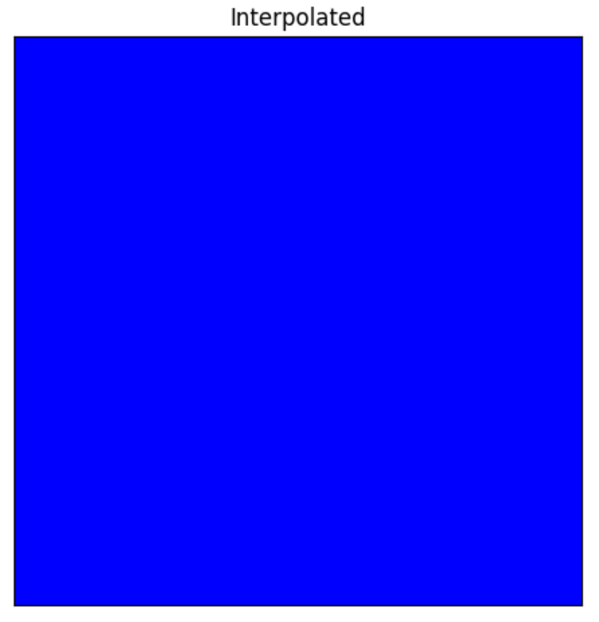

Point classification:

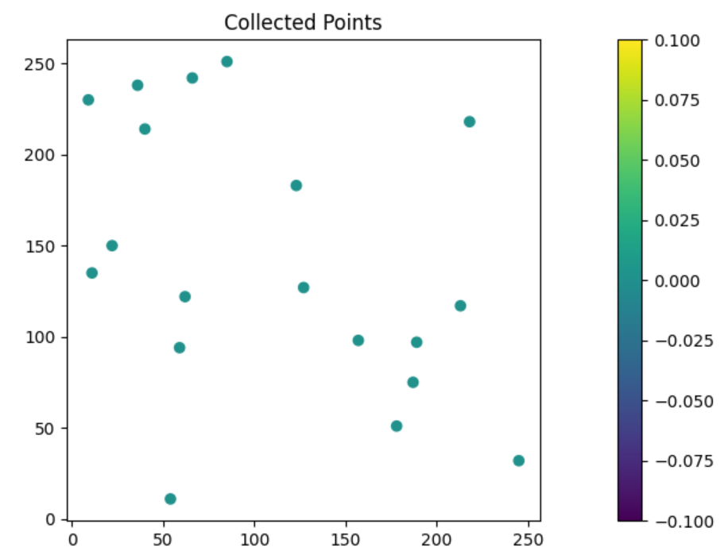

Real experimental results on Au and tungsten disulfide with 4 classes:

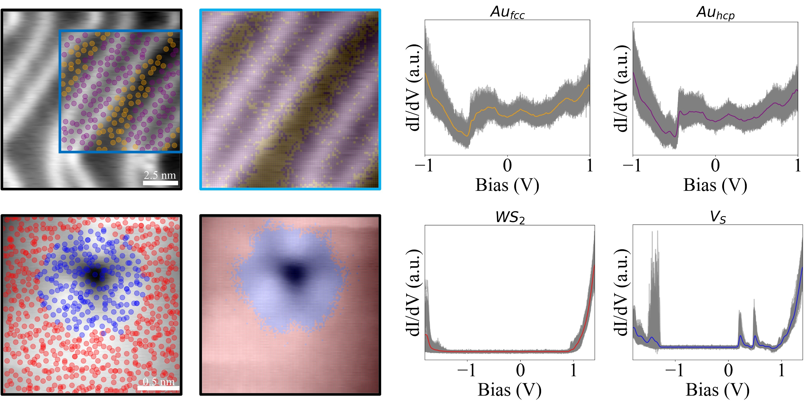

Experimental Workflow:

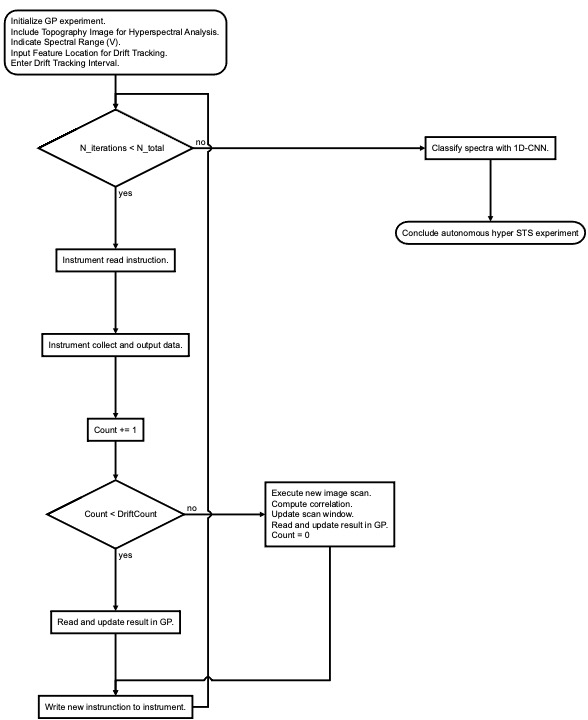

## Citing

If you use `gpSTS` in your work, please cite the accompanying paper:

```bibtex
@article{thomas2021autonomous,
      title={Autonomous Scanning Probe Microscopy Investigations over WS₂ and Au{111}}, 
      author={John C. Thomas and Antonio Rossi and Darian Smalley and Luca Francaviglia and Zhuohang Yu and Tianyi Zhang and Shalini Kumari and Joshua A. Robinson and Mauricio Terrones and Masahiro Ishigami and Eli Rotenberg and Edward Barnard and Archana Raja and Ed Wong and D. Frank Ogletree and Marcus Noack and Alexander Weber-Bargioni},
      year={2021},
      eprint={2110.03351},
      archivePrefix={arXiv},
      primaryClass={cond-mat.mtrl-sci},
      url={https://arxiv.org/abs/2110.03351}
}
